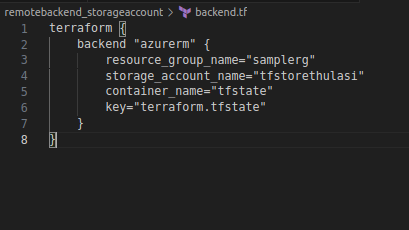
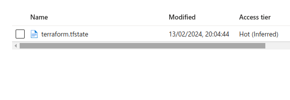

1. create a storage account
 

2. create a container in the storage account

 3. create backend.tf and main.tf
 

 4. terraform init =>the state file is stored in azure storage container

 and verify in azure portal

 

5. terraform plan

5. terraform apply

6. terraform destory