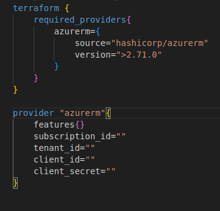

1. az logout - if any previous session 

2. In azure AAD / Entra ID,
    - create service principle using app registration
    - add a secret

    

    - provide the contributor role at the subscription level (IAM)
    
3. in Terraform provider.tf

4. setup main.tf

    - terraform init

    - terraform plan

    - terraform apply -auto-approve

    - terraform destroy

5. revoke the permission and delete the service principle ( app registration)